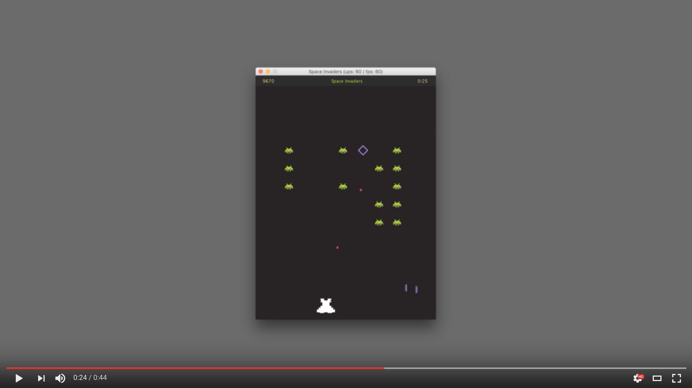

[](https://codeclimate.com/github/MiroslavJelaska/SpaceInvaders)
[](https://codeclimate.com/github/MiroslavJelaska/SpaceInvaders)
# Space Invaders
Game of Space Invaders created in Java without any game engine.

Runnable JAR can be found at [SpaceInvaders/readme-resources/SpaceInvaders-MiroslavJelaska.jar](SpaceInvaders/readme-resources/SpaceInvaders-MiroslavJelaska.jar)

Have some questions or want to give a feedback? You can send me a <a href="mailto:mjelaska.public@gmail.com">an email ✉️</a>

Do you like it? Show it by giving a ⭐️. 🚀

[](https://youtu.be/QaZ_Egr-PVM "Preview of Space Invaders Game in Java (without game engine)")

# Game elements
Visual representation | Package and class name | Type
------------ | ------------- | -------------
 | game.Game (javax.swing.JFrame and java.awt.Canvas) | ui
  | ui.GameOverScreenOverlay | ui
 | ui.StatusRibbon| ui
 | actors.HeroShip | actor
 | actors.HeroProjectile | actor
 | actors.InvaderShip | actor
 | actors.InvaderProjectile | actor
 | vfx.Explosion | vfx

# Execution flow
 

# Game mechanics
## Controls
| Action | Key      |
|--------|----------|
| ⤎ Move Left   | A       |
| Move Right ⤏  | D        |
| Shoot 💥 | Spacebar |

## Points
Points are gained by destroying invader ships, 100 points per each. Bonus points are added for each destroyed ship depending on the time it was destroyed. The sooner in gameplay ship gets destroyed the more bonus points are gained.

Bonus points are given by following function:
```
  BonusPoints(time) = 1000 points * e^(-0.1 * time)
```
This is actualy function of exponential decay where total amount N<sub>0</sub> is 1000 and exponential decay constant 𝛌 is 0.1 within general formula 
.


### Code snippet
``` Java
  private static final int TotalBonusPoints = 1000;
  private static final double ExponentialDecayConstant = -0.1;
  private int bonusPointsWithExponentialDecay(long time){
      return (int)(TotalBonusPoints * Math.exp(ExponentialDecayConstant * time));
  }
```

# Other

## Useful resources

* [gameprogrammingpatterns.com (📖 Book)](http://gameprogrammingpatterns.com/)
* [Killer Game Programming in Java (📖 Book)](https://www.amazon.com/Killer-Game-Programming-Andrew-Davison/dp/0596007302#immersive-view_1419346106105)
* [Ryan van Zeben :: Java 2D Game Engine Development (📺 YouTube)](https://www.youtube.com/playlist?list=PL8CAB66181A502179)
* [gamedev.stackexchange :: Tips for writing the main game loop? (📄 Article)](http://gamedev.stackexchange.com/questions/651/tips-for-writing-the-main-game-loop)
* [higherorderfun.com :: Understanding the Game Main Loop (📄 Article)](http://higherorderfun.com/blog/2010/08/17/understanding-the-game-main-loop/)
* [codeincomplete.com :: Javascript Game Foundations - The Game Loop (📄 Article)](http://codeincomplete.com/posts/javascript-game-foundations-the-game-loop/)
* [The Java™ Tutorials :: Trail: 2D Graphics (📄 Official tutorials)] (http://docs.oracle.com/javase/tutorial/2d/index.html)
* [Fabien Sanglard's website :: Game timers: Issues and solutions. (📄 Article)] (http://fabiensanglard.net/timer_and_framerate/)
* [ZetCode :: Java games tutorial (📄 Article collection)](http://zetcode.com/tutorials/javagamestutorial/)


## Color scheme
Color scheme is inspired by "monokai" color scheme. Colors used in game are:

*  `#231f20` (Game background)
*  `#FFFFFF` (Hero)
*  `#F92672` (HeroProjectile)
*  `#A6E22E` (InvaderShip and StatusRibbon::Title)
*  `#AE81FF` (InvaderProjectile and Explosion)
*  `#282828` (StatusRibbon::Background)
*  `#E6DB74` (StatusRibbon::Text)

## Credits
Audio effects used in the game were downloaded from www.freesound.org and were under CC license. Here I'll mention authors and their audio tracks which were used in this game.

* [THE_bizniss](https://www.freesound.org/people/THE_bizniss) - [laser.wav](https://www.freesound.org/people/THE_bizniss/sounds/39459/)
* [thatjeffcarter](https://www.freesound.org/people/thatjeffcarter) - [inception sound 3.wav](https://www.freesound.org/people/thatjeffcarter/sounds/106521)
* [Julien Matthey](https://www.freesound.org/people/Julien%20Matthey) - [JM_FX_Boom 01a.wav](https://www.freesound.org/people/Julien%20Matthey/sounds/201571)
* [qubodup](https://www.freesound.org/people/qubodup) - [Organic Laser Shot](https://www.freesound.org/people/qubodup/sounds/238991)
